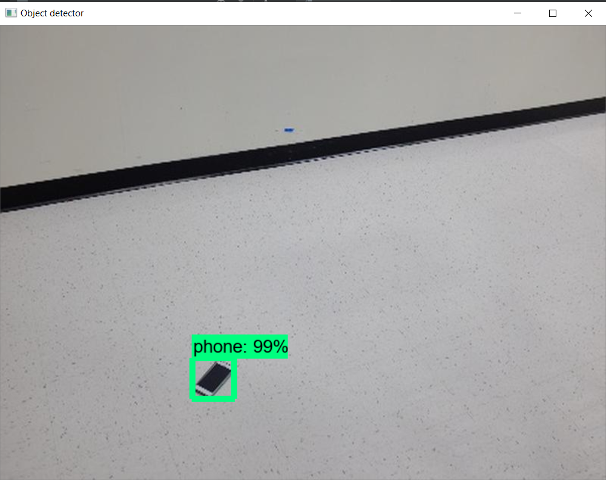
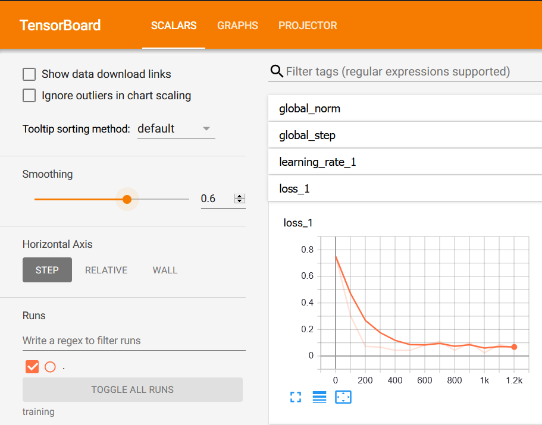

### Repository to find a phone on the floor ! ###

Implemented using Tensorflow - Object Detection - API 

Works on both videos and images with minor modifications.

METHOD:

In this project I find it more useful to have a bounding box to detect the phone rather than having the centre point of the phone as given in labels.txt.

Note that using the train\_phone\_finder.py with the directory of the labels will not work as intended as I have done using hand- labelling all the images myself to have better accuract.

I then reduce the resolution of all the images to a uniform 800x600 so that the training is easier.

Then, I use labelImg application to create bounding boxes which generate the corresponding xml file (for .config file).

After the data is labelled, it is stored as an xml file, I convert this to csv file and then store it as a record file for tensorflow implementation.

To configure training, I first define a label map that identifies the phone with the id '1', then I create a .pbtxt file which is a protbuf file which holds the checkpoint directory, input and output paths.

After training is done, the inference graph is then exported. This inference graph is now used to test the object detector.

Hence, the phone detector is now complete. 

Then I go on to train our model using a pre-trained FasterRCNN with Inception v2. I use transfer learning in this case because the dataset given consists of only 129 images which has been split in 80:20 - training:validation - 103:26 for our purposes which will be insufficient to generate a satisfactory model.

Now, 
find\_phone.py takes a single command line argument which is a path to the jpeg image to be tested. The output will be the center of the mobile phone in normalised co-ordinates.

I found the test result to be atmost 99.9\% accurate in multiple tests I ran over the days. Sometimes, the center of the phone with reflection on the screen is slightly deviated and not within the 0.05 distance, but is very close to it.
